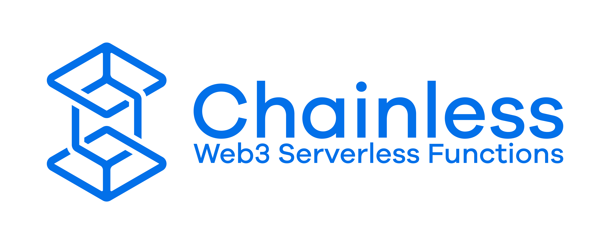

"Serverless Functions" for blockchain events. But you need a server. And a blockchain. So it's neither serverless nor chainless. Modern branding is wonderful.

Smash some code into your keyboard, click submit, and watch as Chainless magically runs your beautifully crafted function against blockchain blocks. Functions can either be Temporary or Persistent. Temporary functions exist only for the lifetime of the connection to the HTTP endpoint. Persistent functions run in the background even when you close your browser.

## Prerequisites
- Electricity
- Computer
- Internet
- Docker
- **Bitcoin**, **Ethereum**, and **Apparatus** are currently supported. You will need **RPC** access to at least one of them.
- **Linux**, specifically Ubuntu, is the only "officially supported" OS. It might work elsewhere, but my soul would dissolve if I run Windows, and I'm not a billionaire so I can't afford a MacBook.
- This service replicates all block data starting from when you first launch. This consumes a lot of **disk space**, like probably a couple million floppy disks.
- A burning passion for minimally tested software.

## Quick Start
1. `docker volume create chainless_data`
   - Creates a persistent location for saving block and function data
1. `docker network create chainless`
   - Creates a dedicated bridge network for function containers
1. `docker run -d --name chainless --restart=always -p 42069:42069 -v chainless_data:/app -v /var/run/docker.sock:/var/run/docker.sock -v  /tmp/chainless:/tmp/chainless --network chainless seancheatham/chainless:latest --ethereum-rpc-address $ETHEREUM_RPC_ADDRESS --bitcoin-rpc-address $BITCOIN_RPC_ADDRESS --apparatus-rpc-address $APPARATUS_RPC_ADDRESS`
   - Substitute your own ethereum, bitcoin, and/or apparatus node addresses.
     - If you don't have one and don't mind centralization, you can use a service like [GetBlock](https://getblock.io/)
     - If you don't have one and need guaranteed chain integrity, you need to install and run your own nodes.
     - At least one chain must be configured.
   - Docker-out-of-Docker is used as a runtime for function containers.
     - The implementation expects the bridge network to be named `chainless`.
     - The implementation expects the `-v  /tmp/chainless:/tmp/chainless` binding exactly as specified.
   - If you like to live on the edge, you can use the `seancheatham/chainless:dev` image tag to try the newest bugs and features.
1. Open [http://localhost:42069](http://localhost:42069) in your cat video browser

## Supported Blockchains
- Bitcoin
- Ethereum
- Apparatus

Support for other chains will be added over time. If you'd like to request one, feel free to file an [Issue](https://github.com/SeanCheatham/chainless/issues). Bonus points if you provide some reference material to assist with the integration. Bonus bonus points if you file a PR with an implementation!

## Supported Languages
**Temporary Functions**
- JavaScript (GraalVM)

**Persistent Functions**
- JavaScript/TypeScript (NodeJS)
- Java/Scala/Kotlin (JVM)

Support for other languages will be added over time. If you'd like to request one, feel free to file an [Issue](https://github.com/SeanCheatham/chainless/issues). Bonus points if you provide some reference material to assist with the integration. Bonus bonus points if you file a PR with an implementation!

## FAQ
- Is Chainless AI-native?
  - No.

## Disclaimers
- This project is still in alpha. It will move into beta/production state once there is sufficient test coverage, so it'll probably never leave alpha.
- The project author trusts the Ballmer Peak and is probably there right now.
- Everything is subject to change. I make no guarantees of backwards compatibility because that would require remembering what I did yesterday. (See above)
- The API and frontend are **not** password-protected. If the port can be accessed, so can the rest of the application.
